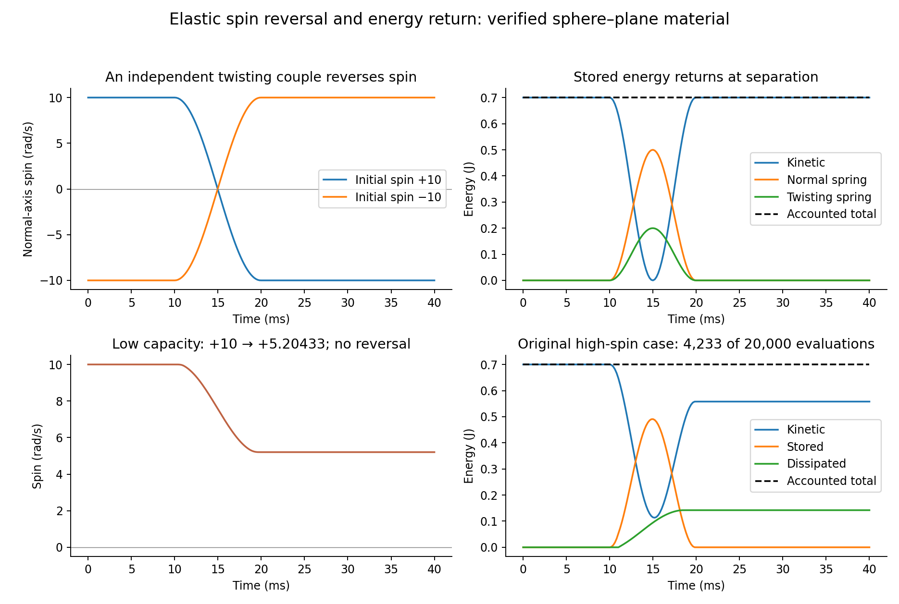
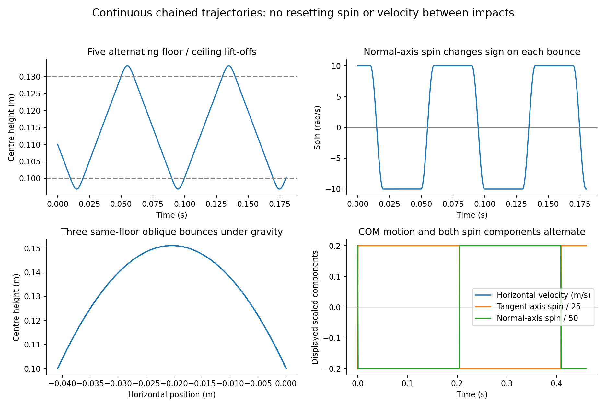
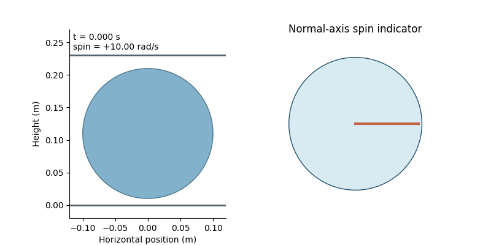
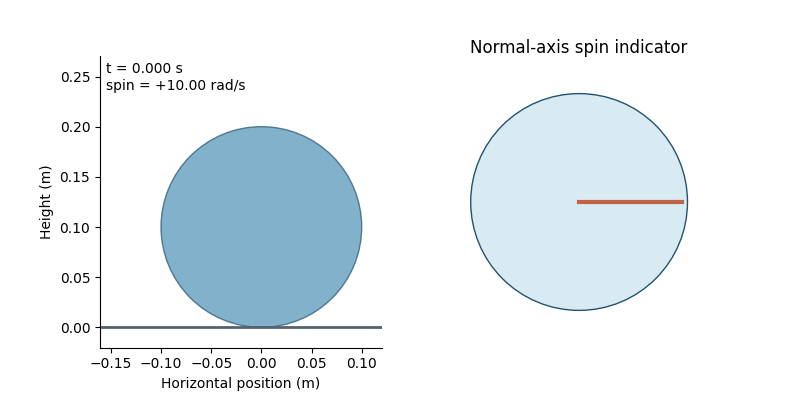

# Completed elastic force-and-couple verification

**10/10 original cases and 18/18 total cases qualify**, with 54 completed histories and no rejected attempts. The frozen source is `7c3a47c46d7c13481f22fbb0dcf694b201581cd2`. Original material parameters, gates, high-spin 20,000-evaluation budget and earlier archives remain unchanged.

Hybrid yield/release events eliminate branch chattering; exact ballistic free flight preserves the same mechanics between contacts. The earlier high-spin low-friction weighted case now completes in 4233 evaluations, with spin +10 → +5.20433335 rad/s, 0.14210701 J dissipated and energy residual 1.59e-14 J. Low friction correctly prevents reversal. Both twist signs are verified.

The continuous vertical floor/ceiling sequence has five alternating impacts. The oblique same-floor gravity sequence has three back-and-forth bounces with horizontal motion and both spin components alternating. Its final residual contact store is released through the resolved yield tail; explicit separation loss is below 5e-18 J. Arbitrary oblique floor/ceiling retracing is not asserted.

[Typeset mechanics, evidence and limits](report.pdf). [Independent audit](independent-audit.json).

This is a fixed-sphere/fixed-plane material prototype. Conditional exact and resolved branches use the same material and agree with the refined histories. It does not yet supply independent elastic couples to the native arbitrary-body engine. Parameters are synthetic rubber-like hypotheses, not measured rubber calibration; neither constitutive novelty nor material authenticity follows from numerical convergence. Costs were collected during collaborative work and do not establish a speed ranking.
