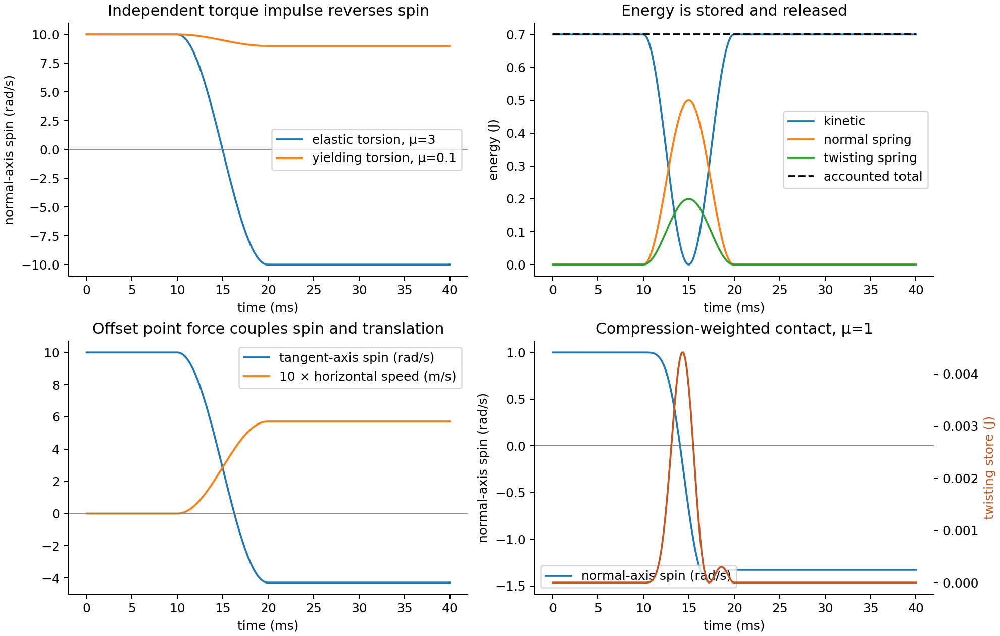
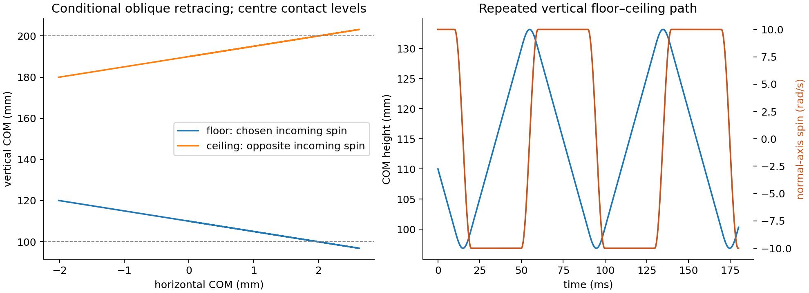

# Elastic force-and-couple contact verification

Frozen source: `78e63313b5d13dd80170d03c54bcaffccbbf47e8`. **5/6 cases meet the frozen gates**; 15 completed histories and 3 retained rejected attempts.

This follow-up changes numerical tolerances only and targets the six original failures. The original [4/10 study and two rejected attempts](../elastic-patch/report.md) remain unchanged. Five additional cases now qualify, making **9/10 distinct examples verified across both studies**; weighted high-spin/low-friction remains rejected. Tangential and oblique figures reuse the previously qualified original traces; other figures use refined traces.

The sphere has an independent twisting couple, in addition to the angular momentum transferred by an offset contact force. Elastic contact history stores energy and can reverse spin; Coulomb dissipation alone does not supply that elastic return. These are synthetic material hypotheses and mathematical verification cases, not a fitted or experimentally authenticated rubber model.

| Case | Qualified | Fine outgoing velocity (m/s) | Fine outgoing spin (rad/s) | Energy residual (J) |
|---|---:|---|---|---:|
| elastic-normal-axis-spin | yes | 0, 0, 1 | 0, 0, -10 | 2.88e-14 |
| vertical-floor-ceiling | yes | 0, 0, 1 | 0, 0, -10 | 3.39e-14 |
| low-friction-no-spin-reversal | yes | 0, 0, 1 | 0, 0, 9 | 2.75e-14 |
| compression-weighted-reversal | yes | 0, 0, 0.998478 | 0, 0, -1.32682 | 1.58e-14 |
| rapid-same-material | yes | 0, 0, 100 | 0, 0, -1000 | 3.91e-11 |
| weighted-high-spin-low-friction-budget | no | rejected | rejected | — |

The matched linear normal/torsional oscillators use one contact duration, return both spring stores to zero, reverse 10 rad/s to −10 rad/s, and preserve total energy. The coupled tangential oscillator reverses horizontal-axis spin from 10 to −30/7 rad/s while generating COM speed 4/7 m/s. The low-friction case ends at +9 rad/s with 0.038 J dissipated, showing that sufficiently strong elastic contact and the yield budget both matter.

The default compression-weighted potential includes its normal derivative, so energy can transfer between normal and rotational channels. An individual channel can have an effective restitution larger than one while the complete system remains passive. The shared ellipsoidal shear/couple yield is a phenomenological soft-finger approximation; it is not an exact traction limit surface for every pressure distribution. One friction coefficient covers sticking and sliding. Normal damping acts during compression only.

Oblique retracing requires the chosen spin and elastic stiffness; it is not universal. Floor and ceiling oblique examples use opposite incoming tangent-axis spins. The repeated floor–ceiling example follows a vertical path with normal-axis spin reversing on each impact. All finite contact compression uses a reference lever arm equal to the undeformed sphere radius.

Slow and rapid tests use the **same** stiffness, mass, radius and friction parameters, with speeds 0.01 and 100 m/s. This verifies the integration strategy over a broad rate range for this ideal elastic law; it does not demonstrate rate-independent real rubber. The high-spin low-friction weighted case has a frozen RHS evaluation budget; exhaustion is retained as rejection, with no accepted state fabricated.

Timings were collected while native friction research ran concurrently. They describe these executions and are not an engine speed ranking. Reference refinement uses three DOP853 settings with frozen state, energy and yield budgets. Stored ZIP traces and source files permit independent energy, momentum and impulse bookkeeping. The reported internal-step yield peak is numerical, rather than a continuous mathematical supremum.

[Typeset mechanics and evidence](report.pdf). [Independent mechanics and literature review](../elastic-patch/review.md).
