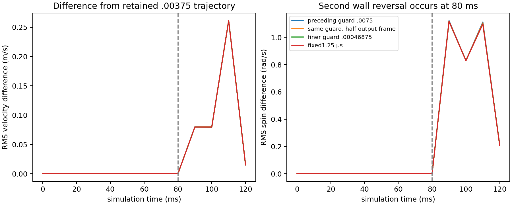

# Fast shaking: retained failure, resolved references

The same 27 spheres and six-wall container were tested at wall speeds ±20 m/s, with gravity, synthetic pair friction 0.4 and zero normal restitution. Both prospectively declared finer references now meet the unchanged quarter trajectory budgets and physical gates. The original failed study remains unchanged.

The finest old guard fraction 0.00375 had a nonmonotonic trajectory jump. A reproduction with the corrected current backend preserves this branch within 0.00000178 m/s overall RMS. Merely halving output-frame duration adds three internal updates, while keeping the travel cap and physical model unchanged; its prefix agrees through 80 ms to roughly 5e-14 m/s and then follows a different branch after the second reversal. Both solutions satisfy the native contact residual below 1e-8 m/s.

| Declared reference | Position edge (m) | Velocity edge (m/s) | Spin edge (rad/s) | Orientation edge (rad) | Pass |
|---|---:|---:|---:|---:|---:|
| Fixed: 5 → 2.5 us | 0.00001038 | 0.000957 | 0.022080 | 0.0004491 | yes |
| Fixed: 2.5 → 1.25 us | 0.00000818 | 0.000812 | 0.015150 | 0.0003148 | yes |
| Guard: 0.001875 → 0.0009375 | 0.00000336 | 0.000630 | 0.007231 | 0.0001120 | yes |
| Guard: 0.0009375 → 0.00046875 | 0.00000345 | 0.000639 | 0.006628 | 0.0000802 | yes |

Each edge must meet quarter budgets: 0.00125 m position, 0.0125 m/s velocity, 0.025 rad/s spin and 0.0025 rad orientation. All three runs in each reference also pass quaternion norm, energy minus measured wall work and internal-update container surface gates. The two finest references agree with each other within these quarter budgets.

| Original candidate | Spin RMS error versus fixed reference | Spin RMS error versus guard reference | All 3 runs pass full budgets and physical gates |
|---|---:|---:|---:|
| coarse | 1.12076 | 1.12917 | no |
| medium | 0.397043 | 0.405615 | no |
| fine | 0.0667748 | 0.0750752 | yes |

The archived fine candidate, travel fraction 0.015, passes against both newly qualified references in all three retained repetitions. Its full-budget velocity error is about 0.00172 m/s and spin error 0.0668–0.0751 rad/s. This is an offline comparison against new evidence, not a rewrite of the original candidate verdict. Medium and coarse candidates remain unqualified.

The demonstrated failure mechanism is sensitivity to the internal timestep partition near simultaneous contacts. The deeper cause is not yet established: contact birth/retention thresholds, position projection, variable-step warm-start pressure and nonunique Coulomb pressure selection are candidates. This evidence does not distinguish them or prove mathematical nonuniqueness. A frozen contact residual is not a trajectory certificate.

A useful engineering next step is to make the internal step calendar independent of output-frame sampling, then preserve the same contact law and repeat changing-output-frame tests. Fixed steps already supply a qualified reference for this scene. Variable travel guards require whole-trajectory refinement checks; reducing the travel fraction alone was not monotonic. Changing physical compliance or inventing a pressure regularizer would require a separately declared model and its own validation.

Two planning errors are retained explicitly. The first plan incorrectly described fixed 5/2.5 microsecond steps as finer than the failed guard: the feature is wall half-thickness 0.025 m, and that guard averaged about 2.21 microseconds. The unchanged extension documents the correction. The requested 8000 primary steps exceeded the adapter limit 4096 and was rejected before simulation. A separately frozen equivalent 1.25 microsecond control uses output dt 0.005 s with 4000 primary steps; comparisons align common 10 ms output times.

Eight accepted histories and the input-validation rejection are archived. Source snapshots, source-commit checks, binary hash, dependency/input hashes and independent physical/gate recomputation are audited. Three evidence-integrity tests detect consistently rehashed forged qualification and initial geometry.

Timings came from concurrent research executions and are descriptive only. Neither a speed ranking nor experimental material authenticity is inferred. The horizon is 0.12 s and this reference concerns these 27 spherical bodies; arbitrary hulls and elastic independent torque impulses need their separate evidence.
