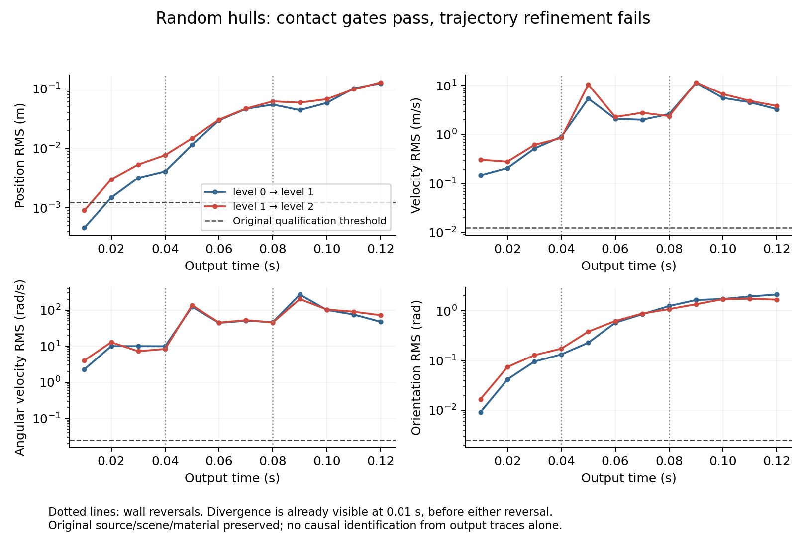

# Why the completed eight-hull traces are not yet accuracy references

All three seed42 runs finish and satisfy their local contact gates, but the trajectories fail the original refinement rule. The independently computed errors first exceed velocity, spin and orientation thresholds at the first available output, **0.01 s**. Position RMS first exceeds its quarter-budget threshold at **0.02 s**. These differences begin before either wall reversal at 0.04 or 0.08 s.

The analysis is read-only. Its plan precedes the numerical analysis, input hashes pin the completed checkpoints, and the archived engine source is independently checked against `108a9bb4c7899f75d760b27b179cc56557904a08`. No native execution, build, material change, tolerance change or skipped refinement level was used. One initial analyzer status-schema assertion failed before numerical analysis; that failed attempt is retained separately.

## Measured differences

RMS values include only the eight dynamic bodies. Quaternion angles use the shortest relative rotation and are checked independently with SciPy rotations. Global values average all 13 output frames and all eight bodies.

| Pair | Position RMS, first 0.01 s (m) | Velocity RMS (m/s) | Spin RMS (rad/s) | Orientation RMS (rad) |
|---|---:|---:|---:|---:|
| fraction 0.06 → 0.03 | 0.000462 | 0.1485 | 2.277 | 0.009181 |
| fraction 0.03 → 0.015 | 0.000903 | 0.3086 | 4.013 | 0.016740 |
| Original quarter-budget threshold | 0.00125 | 0.0125 | 0.025 | 0.0025 |

| Pair | Whole-run position RMS (m) | Velocity RMS (m/s) | Spin RMS (rad/s) | Orientation RMS (rad) |
|---|---:|---:|---:|---:|
| fraction 0.06 → 0.03 | 0.05365 | 4.2965 | 93.147 | 1.13982 |
| fraction 0.03 → 0.015 | 0.05654 | 5.1861 | 83.423 | 1.01204 |

At the first output the finer adjacent edge has approximately twice the position and velocity error. Its position/velocity error vectors nearly oppose the coarser edge (cosines −0.954 and −0.950). This is incompatible with a demonstrated smooth monotone convergence regime for these levels. It is compatible with contact-event or timestep-grid sensitivity, but does not identify the cause. Large spin/velocity differences recur at outputs 0.05 and 0.09 s, following wall reversals; those reversals amplify a difference that already exists.



`analysis.json` retains every per-frame RMS value, per-body threshold crossing/contribution, update count, average internal timestep and independently calculated energy/momentum. The first pair's largest global spin contributors are bodies6 and8; the finer pair's are bodies3 and6. These later contributors do not establish which contact caused the first difference.

## What can be ruled out, and what remains open

Container positions agree across levels to at most 6.33e-15 m. Container velocities, angular velocities and orientations agree exactly. Independently integrated prescribed positions match within 3.89e-15 m. At an output exactly on a schedule reversal, the recorded velocity is the velocity of the just-finished interval; the next internal update installs the new command. This convention is identical across levels. The observed disagreement is therefore not supported as a prescribed-wall clock or output-endpoint mismatch.

Maximum contact residuals are below 1e-8 m/s in all three runs. Their final energy minus boundary work is negative, approximately −8123, −8101 and −8045 J. That upper energy gate verifies passivity, not the accuracy of how much friction dissipates. Numerical pose effects decrease with refinement: absolute gravity-potential repair totals are approximately 0.00416, 0.00254 and 0.000989 J. A small energy ledger or strict algebraic residual does not certify contact timing, normals, lever arms, unique impulse roots or trajectory convergence.

There are no internal contact-event traces, matched-timestep repeatability runs, fixed timestep-grid comparisons or frozen-matrix warm/cold physical-velocity comparisons here. Chaos, manifold-cache sensitivity and multiple rigid-friction roots are therefore **plausible mechanisms, not established causes**. Counts alone do not provide exact internal update endpoints or contact order. The earliest actual difference is bracketed somewhere between initial time and the first 0.01 s output.

## Collision discovery that is actually configured

The frozen adapter [wraps every body in a compound shape](https://github.com/svenviktorjonsson/rigid-body-collisions/blob/108a9bb4c7899f75d760b27b179cc56557904a08/spatial_backend/runner.cpp#L78), even a body with one hull. It sets neither CCD motion threshold nor CCD swept-sphere radius. Both default to zero in [Bullet's collision-object constructor](https://github.com/bulletphysics/bullet3/blob/2c204c49e56ed15ec5fcfa71d199ab6d6570b3f5/src/BulletCollision/CollisionDispatch/btCollisionObject.cpp#L48).

Bullet's dispatcher defaults to continuous mode, but its [predictive](https://github.com/bulletphysics/bullet3/blob/2c204c49e56ed15ec5fcfa71d199ab6d6570b3f5/src/BulletDynamics/Dynamics/btDiscreteDynamicsWorld.cpp#L863) and [clamping](https://github.com/bulletphysics/bullet3/blob/2c204c49e56ed15ec5fcfa71d199ab6d6570b3f5/src/BulletDynamics/Dynamics/btDiscreteDynamicsWorld.cpp#L965) branches require a nonzero motion threshold and a convex top-level collision shape. Those conditions do not hold. Simply setting a body CCD threshold would still leave the compound-shape condition unsatisfied. Swept-sphere clamping would also not be exact arbitrary-polyhedron impact timing.

The [actual step order](https://github.com/bulletphysics/bullet3/blob/2c204c49e56ed15ec5fcfa71d199ab6d6570b3f5/src/BulletDynamics/Dynamics/btDiscreteDynamicsWorld.cpp#L452) discovers discrete contacts, solves constraints, then integrates transforms. Positive-gap normal rows use a [gap-over-timestep term](https://github.com/bulletphysics/bullet3/blob/2c204c49e56ed15ec5fcfa71d199ab6d6570b3f5/src/BulletDynamics/ConstraintSolver/btSequentialImpulseConstraintSolver.cpp#L949). This is finite-step speculative treatment; the adapter is not locating and splitting at exact contact times.

The [travel guard](https://github.com/svenviktorjonsson/rigid-body-collisions/blob/108a9bb4c7899f75d760b27b179cc56557904a08/spatial_backend/runner.cpp#L130) uses the largest current translational plus angular tip speed, gravity and the minimum shape feature. It clips prescribed command times and output endpoints, but it has no geometric distance/TOI argument. The actual initial minimum feature is 0.025 m. Initial timestep bounds are 37.34, 18.69 and 9.355 μs; first-frame average timesteps are approximately 25.25, 12.61 and 6.305 μs. The guard limits travel; it does not certify impact-time or manifold accuracy.

Persistent contact retention uses Bullet's default [relative contact-breaking factor](https://github.com/bulletphysics/bullet3/blob/2c204c49e56ed15ec5fcfa71d199ab6d6570b3f5/src/BulletCollision/CollisionDispatch/btCollisionDispatcher.cpp#L74) 0.02 times a shape angular-motion-disc estimate, taking the smaller body value. Reconstructing the actual constructor order gives hull-compound estimates of **5.15–7.06 mm**, distinct from the engine's declared 1 nm contact slop. These are source/shape estimates, not observed live manifold thresholds. [Refresh logic](https://github.com/bulletphysics/bullet3/blob/2c204c49e56ed15ec5fcfa71d199ab6d6570b3f5/src/BulletCollision/NarrowPhaseCollision/btPersistentManifold.cpp#L247) updates endpoint distances with stored normals and retains points until separation/tangential thresholds remove them. Cache history can thus vary with discovery steps; the current data do not prove that it caused this failure.

## A proven constructor inconsistency, with causality still open

The frozen [hull constructor](https://github.com/svenviktorjonsson/rigid-body-collisions/blob/108a9bb4c7899f75d760b27b179cc56557904a08/spatial_backend/runner.cpp#L83) calls `recalcLocalAabb()` before setting the declared margin. At that time the inherited margin is Bullet's default **0.04 m**. [Recalculation](https://github.com/bulletphysics/bullet3/blob/2c204c49e56ed15ec5fcfa71d199ab6d6570b3f5/src/BulletCollision/CollisionShapes/btPolyhedralConvexShape.cpp#L505) stores bounds enlarged by that margin. Inherited [`setMargin`](https://github.com/bulletphysics/bullet3/blob/2c204c49e56ed15ec5fcfa71d199ab6d6570b3f5/src/BulletCollision/CollisionShapes/btConvexInternalShape.h#L102) then changes the scalar without recalculating those cached bounds. The compound is subsequently built from the stale child bounds.

For these declared-zero-margin hulls, support geometry therefore uses zero margin while cached hull bounds retain 40 mm of padding on each axis. This enlarges broad-phase overlap and the relative contact-breaking estimate. The source inconsistency is concrete; attributing the refinement failure to it would require a fresh, matched trajectory study.

Set the declared margin **before** recalculating the hull bounds and inserting the child in its compound. This preserves physical vertices, declared margin, mass, inertia and material, and changes the numerical cache policy. Consistent zero-margin source estimates are **3.53–4.84 mm**. Our initial estimate inadvertently used that consistent order; its original code/output remain as `.historical` files, with the correction declared in `collision-cache-plan.json`.

A separate prospective native constructor control is prepared in `research/hull-aabb-cache-review`; it has not been compiled or executed by this read-only analysis. It compares old/corrected order, actual support, compound bounds and threshold estimates. At nonzero declared margin, Bullet's cached-bound implementation conservatively adds the margin twice, whereas vertex support adds it once. Exact support/bounds equality is therefore required only for zero-margin identity transforms; rotated and nonzero-margin bounds must satisfy the source formula and contain the actual support.

## Minimum useful next experiment and remedy

1. Validate the constructor-order correction with the prospectively frozen native controls, then freeze a paired full-horizon study retaining the original material and gates. This directly tests the proven cache inconsistency without asserting a trajectory improvement. Also freeze an **observer-only first-window replay** of the same eight-body scene. Keep the existing output timestep/guard/material/gates. Record internal time and h, all accepted body states, contact pair/feature IDs, normals, common lever points, signed gaps, cached/new point status, original A/b and accepted impulses until 0.01 s. Increasing ordinary output frequency would itself alter the current `dt/primary` cap, so it is not an equivalent observer.
2. Locate the earliest differing contact/state. For one identical captured configuration, compare warm/cold strict roots and report the induced body velocity difference, not only pressure differences. A pressure gauge with identical body velocity is distinct from a physically different rigid-friction root. Replay a matched internal grid separately to test feedback from state-dependent step selection. Declare these diagnostic variations prospectively and retain failures.
3. If event/grid sensitivity is confirmed, test **child-convex conservative advancement/contact bracketing with transactional rollback**. Include relative prescribed wall motion and rotational bounds, group simultaneous events, re-query actual geometry, then apply the unchanged Coulomb material law at the resolved configuration. Keep a bounded retry/work budget and reject when it exhausts. Compound bodies require child-level queries or a geometrically equivalent convex representation; threshold flags alone are insufficient.

The initial free horizontal-motion geometry predicts the first negative-x-wall encounter for body4 at about 0.003288 s, followed by the other left-column bodies. This is a useful observer window, not an observed native TOI or a proof that later interactions follow those free-motion times. If manifold/feature changes dominate instead, stable geometry-derived contact patches and feature-transition resolution are a separate numerical experiment. If physically distinct roots persist at an identical configuration, a constitutive impact selection rule must be declared and validated; extra solve effort alone cannot identify a unique physical history.

A full-horizon production fix must pass the original physical and refinement gates. No relaxed trajectory metric, invented physical calibration or universal improvement claim follows from these diagnostics.

Reproduce the independent audit without running the native engine:

```sh
OPENBLAS_NUM_THREADS=1 python3 research/gap-hull42-divergence-review/audit.py
```
