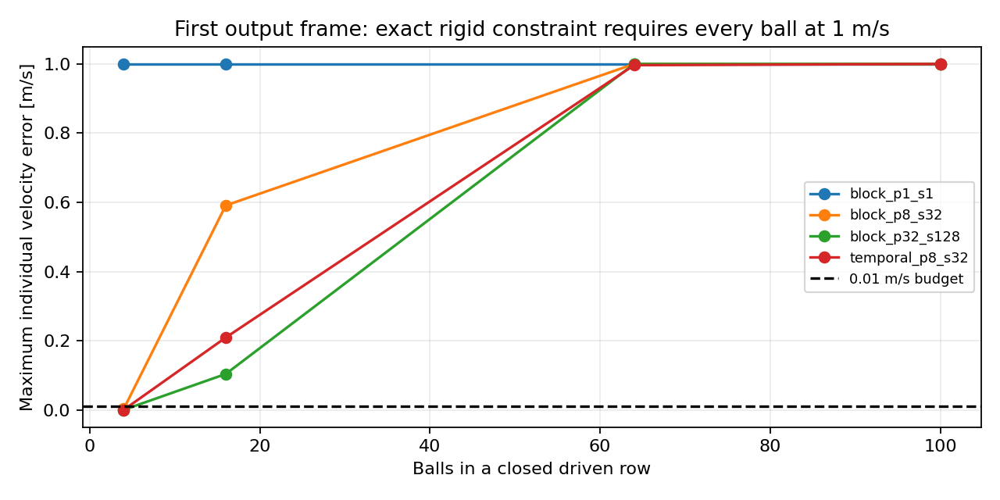

# Moving-container verification report

Executed on 4 October 2026. Synthetic numerical verification of declared rigid mechanics; no experimental material validation or universal best-solver claim.

The archive retains **53 histories**. Each setting has one warm-up and 3 recorded timing samples. All 54 Python/research tests pass. Native comparators are pinned Box2D 2.4.1 (block) and 3.1.1 (temporal). This study does not execute Vektor, WASM or physical GPU. Timing measures solver plus controller, excluding Python, JSON, state readout and process startup. Results are from one Linux machine, not a controlled cross-platform throughput study.

## Independent exact packed-row check

N touching unit-mass disks initially rest inside a closed box translating at 1 m/s. For the declared rigid, zero-restitution, frictionless constraints, every outgoing ball must move at 1 m/s. The first-output-frame maximum individual error budget is 0.01 m/s. Expected momentum is N kg m/s, kinetic energy N/2 J, actuator work N J and dissipation N/2 J. Native first-frame failure includes contact discovery and floating geometry; it cannot be attributed solely to iterations. A physical elastic chain would transmit finite-speed waves.

| Balls | Setting | Max velocity error (m/s) | Budget met | Median solver+controller (ms) |
|---:|---|---:|:---:|---:|
| 4 | block_p1_s1 | 1 | no | 0.02028 |
| 4 | block_p8_s32 | 0.0025841 | yes | 0.06809 |
| 4 | block_p32_s128 | 1.431e-06 | yes | 0.6326 |
| 4 | temporal_p8_s32 | 1.2517e-05 | yes | 0.258 |
| 16 | block_p1_s1 | 1 | no | 0.03167 |
| 16 | block_p8_s32 | 0.590995 | no | 0.2273 |
| 16 | block_p32_s128 | 0.103714 | no | 3.006 |
| 16 | temporal_p8_s32 | 0.209123 | no | 0.4029 |
| 64 | block_p1_s1 | 1 | no | 0.07278 |
| 64 | block_p8_s32 | 1 | no | 0.5702 |
| 64 | block_p32_s128 | 1 | no | 9.514 |
| 64 | temporal_p8_s32 | 0.996492 | no | 1.361 |
| 100 | block_p1_s1 | 1 | no | 0.107 |
| 100 | block_p8_s32 | 1 | no | 1.049 |
| 100 | block_p32_s128 | 1 | no | 14.82 |
| 100 | temporal_p8_s32 | 1 | no | 2.467 |

The independent dense frozen normal projection satisfies all four rows with maximum velocity error 5.68e-14 m/s and checked complementarity residuals. This is a correctness oracle, not a complete frictional engine or a measured performance winner.

## Frictional 100-ball motion

Each scene lasts 2 s, with gravity -9.81 m/s², radius 0.1 m, mass 1 kg, friction 0.4 and restitution 0. Four wall fixtures move as one kinematic body. Motion is translation at 0.6 m/s, reversals every 0.5 s, or rotation at 0.5 rad/s. These coefficients are idealized declarations. Fine simulation is not physical ground truth.

Reference qualification requires every adjacent edge in two separate sweeps to meet quarter budgets: position RMS 0.005 m, velocity RMS 0.0125 m/s and spin RMS 0.0125 rad/s. Primary updates are 16/32/64 at 128 iterations; iterations are 32/64/128 at 64 primary updates. The highest-work state is only a candidate reference unless all four edges pass.

| Motion | Reference qualified | Worst refinement / quarter budget |
|---|:---:|---:|
| translate | no | 45.2 |
| shake | no | 96.7 |
| rotate | no | 40.72 |

| Motion | Setting | Position RMS (m) | Velocity RMS (m/s) | Spin RMS (rad/s) | Qualified accuracy pass |
|---|---|---:|---:|---:|:---:|
| translate | block_p1_s1 | 0.124 | 0.3281 | 1.398 | unqualified |
| translate | block_p1_s8 | 0.06287 | 0.1727 | 1.071 | unqualified |
| translate | block_p4_s16 | 0.03521 | 0.094 | 0.7361 | unqualified |
| translate | block_p8_s32 | 0.02784 | 0.07779 | 0.7241 | unqualified |
| translate | temporal_p4_s16 | 0.0865 | 0.1257 | 1.065 | unqualified |
| translate | block_adaptive | 0.03617 | 0.1106 | 0.937 | unqualified |
| shake | block_p1_s1 | 0.1243 | 0.4826 | 2.276 | unqualified |
| shake | block_p1_s8 | 0.05912 | 0.2965 | 1.863 | unqualified |
| shake | block_p4_s16 | 0.02256 | 0.2055 | 1.397 | unqualified |
| shake | block_p8_s32 | 0.02378 | 0.1687 | 1.344 | unqualified |
| shake | temporal_p4_s16 | 0.07096 | 0.1882 | 1.251 | unqualified |
| shake | block_adaptive | 0.02842 | 0.2049 | 1.402 | unqualified |
| rotate | block_p1_s1 | 0.1337 | 0.2902 | 1.701 | unqualified |
| rotate | block_p1_s8 | 0.05092 | 0.1516 | 0.9723 | unqualified |
| rotate | block_p4_s16 | 0.0152 | 0.08127 | 0.6194 | unqualified |
| rotate | block_p8_s32 | 0.0158 | 0.07317 | 0.5944 | unqualified |
| rotate | temporal_p4_s16 | 0.09754 | 0.1351 | 1.021 | unqualified |
| rotate | block_adaptive | 0.02168 | 0.08344 | 0.6575 | unqualified |

Candidate budgets are 0.02 m, 0.05 m/s and 0.05 rad/s. Comparisons against an unqualified reference are diagnostic and cannot establish accuracy. No tolerance was relaxed after looking at the results. The current adaptive controller is a whole-world heuristic; this study does not certify error-controlled adaptation.

## Controls and geometric diagnostics

| Control, 100 balls | Max position difference (m) | Max velocity difference (m/s) | Max spin difference (rad/s) |
|---|---:|---:|---:|
| galilean_100 | 0.001254 | 0.002916 | 0 |
| comoving_100 | 3.624e-06 | 2.38e-08 | 0 |
| reverse_body_order_100 | 0.0009751 | 0.006165 | 0 |

Controls cover a Galilean boost, joint free translation of box and contents, and reversing body insertion order. Differences are reported rather than hidden. Containment is checked in the actual rotating box frame. Independent disk-pair distances and wall extents are checked at every output frame.

| Motion | High setting max disk overlap (m) | High setting max wall violation (m) |
|---|---:|---:|
| translate | 0.001032 | 0.0006252 |
| shake | 0.001581 | 0.001498 |
| rotate | 0.00102 | 0.0007355 |

Observed geometry does not prove continuous no-tunneling. Contents momentum is not conserved under moving walls. The constant-translation, zero-gravity row and control runs include actuator-work accounting. Shaking and rotation need a future time-resolved contact reaction ledger; no exact work result is claimed for them.

## Consequences for the engine

The packed-row failures falsify a universal accuracy claim for the current high preset. Spend work within one unchanged physical law, preserving contact/history states, and investigate sparse globally coupled island solves. The normal oracle establishes the target constraints but does not yet supply a complete Coulomb friction solver. Combine convergence, independent analytic tests, contact/CCD geometry and energy plus actuator work; residuals alone do not bound future trajectory error.

An accuracy order through discontinuous impacts has not been established. Use per-observable tolerances and event timing, and test smooth-region integration order separately. Authentic elastic tangential/rolling rebound needs measured response and stored contact history. Coarse deformable cells require additional degrees of freedom, not merely material labels on a rigid body. The established contact algebra and coefficient-based friction model remain nonnovel; the joint publication verdict remains conditional.

## Reproduction and evidence

Run `python -m research.audit_container_study` to independently check the archive, all trajectory comparisons, analytical row metrics and reference gates. The plan, source, summary, failures and every full trace are retained. See README.md for build/reproduction commands and contact-model.pdf for typeset mathematics.

Execution source: `6a805dbbf940b2ba448c006d031db4f201a4e1ff`. Archive SHA-256: `a96c4e19d500b043abdb52b8571b65cc22f8c501362290e80b02bd08bf44098d`.

Sources supporting the method choices: [Catto, Solver2D](https://box2d.org/posts/2024/02/solver2d/), [Box2D simulation](https://box2d.org/documentation/md_simulation.html), [MuJoCo contact computation](https://mujoco.readthedocs.io/en/stable/computation/index.html). Prior-art references and opposing reviews are retained in research/critical-review.md, publication-case.md and joint-verdict.md. No reference is used to turn synthetic coefficients into experimental measurements.
