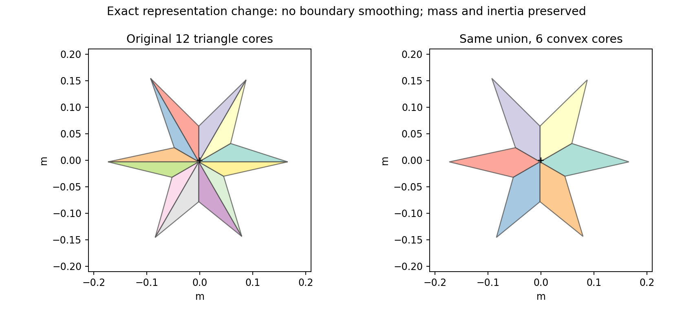
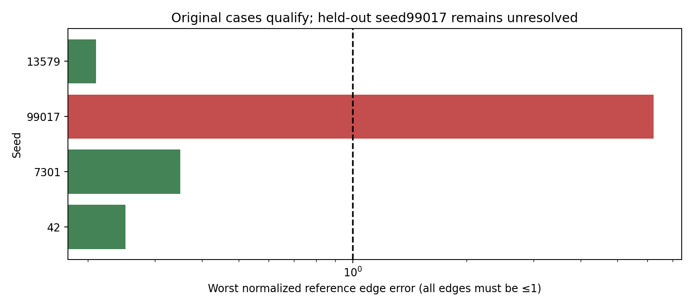
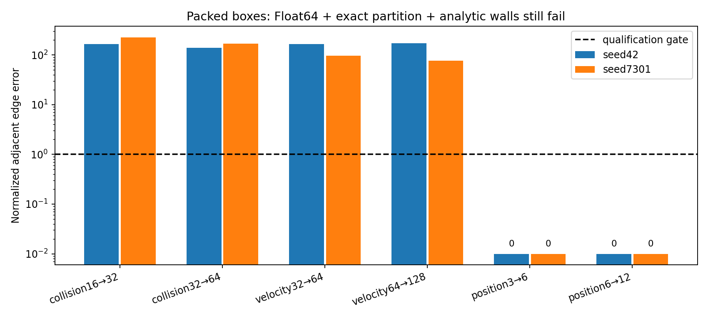

# Random-shape fixes and remaining accuracy limits

Executed 5 October 2026. Both original native geometry rejections are fixed, and both original concave drops now have qualified references. **The two packed-box trajectories remain unresolved.** This is 2D numerical verification with synthetic coefficients; no 3D, material-authentication or universal accuracy claim.

## Concrete changes

- Preserve shallow convex corners through scaled native hull authoring, then restore the original core dimensions. No smoothing or corner removal, and no world-unit/solver-slop change.
- Merge adjacent equal-material convex fixtures only when the hull equals their union. Preserve every original core through containment and equal area, exact mass/COM/inertia, and heterogeneous or stateful patch boundaries. The original star drops go from twelve triangles to six convex pieces; the two mixed boxes go from 150/134 fixtures to 87/79.
- Add separately controlled block position iterations and analytic prescribed-wall pose correction. Prescribed velocity remains unchanged; contents are not repositioned.
- Add an explicitly experimental full-Float64 diagnostic build with checked upstream archive and original/transformed source inventories. It is a locally transformed Box2D 2.4.1 comparator, not an upstream-supported Float64 release or a general feature certification.
- Add offline `fidelity.select()`: qualify supplied references on adjacent refinement edges, compare unchanged physical setups, then select the cheapest passing measured candidate. An unqualified reference produces no verified choice. This is not a universal online error estimator.

The optional internal-point filter is also retained for diagnosis. It rejects reactions directed into another fixture core. It does not merge duplicate exterior manifolds and is off by default; it did not resolve packed refinement in exploratory controls.

## Original concave cases and fresh seeds

The original position/velocity/spin RMS reference budgets remain 0.005 m, 0.0125 m/s and 0.0125 rad/s; candidate budgets are four times larger. Collision updates refine 128 → 256 → 512 at 64 velocity iterations, while velocity iterations refine 32 → 64 → 128 at 512 collision updates. All four adjacent edges must pass. The original low-work failures remain archived, rather than overwritten.

The new protocol was frozen after exploratory diagnosis and before this repeated study. Its controller settings were selected using the original cases, then frozen for two previously untested seeds, 99017 and 13579. Each concave mode has one warm-up and three repetitions. Three of four references qualify: both original cases and seed13579. Seed 99017 still fails and gets no verified choice. No thresholds or material values were changed after observing held-out results.

| Seed | Reference qualified | Worst normalized refinement error | Cheapest passing setting | Controller error / candidate budget |
|---:|---|---:|---|---:|
| 42 | True | 0.2509 | candidate_p32_s32 | 0.03744894932072921 |
| 7301 | True | 0.3507 | candidate_p64_s32 | 0.09763948932613661 |
| 99017 | False | 6.231 | none | unqualified |
| 13579 | True | 0.2099 | candidate_p32_s32 | 0.03057107564354467 |

The frozen controller uses 128 collision updates and 32 velocity iterations during high-motion phases (`travel_threshold=0.02`), then demotes with the existing contact/travel/dwell policy. All three qualified controller trajectories pass. Its cost includes controller work. It is slower than the retrospectively cheapest passing fixed setting in all three cases, so it is not recommended as a universal default.

| Seed | Fixed128×32 median (ms) | Controller median (ms) | Fixed/controller ratio | Cheapest passing fixed median (ms) |
|---:|---:|---:|---:|---:|
| 42 | 149.355 | 86.730 | 1.722 | 41.087 |
| 7301 | 132.386 | 96.441 | 1.373 | 64.097 |
| 13579 | 147.420 | 59.974 | 2.458 | 40.086 |

Compared with keeping its own fine setting throughout, the controller uses **1.37–2.46× less native time**, with the same physical parameters. This is a bounded result on three qualified scenes, not an arbitrary-shape speedup or superiority over the cheapest fixed setting. Single-thread BLAS/OMP; times exclude Python/process startup and serialization.

## Packed boxes: still unqualified

Both 36-body boxes were tested with exact convex partition merging, full native Float64 geometry/solver arithmetic, analytic wall motion and independent position refinement. The physical friction/restitution values and original accuracy gates were retained. Six edges refine collision updates16/32/64, velocity iterations32/64/128, and position iterations3/6/12. All six must pass. These are single diagnostic runs, with no timing speedup claim.

| Seed | Worst normalized edge error | Position3/6/12 histories | Qualified |
|---:|---:|---|---|
| 42 | 170.9 | identical | False |
| 7301 | 227.6 | identical | False |

Position refinement yields identical histories at these settings, while collision and velocity refinement still fail badly. Thus the tested position-iteration count alone does not explain the remaining failure. Fixing wall drift, scalar precision and reducing partition seams is also insufficient. Exploratory runs at512collision updates and 2048 velocity iterations separately remained unqualified; those logs informed the frozen fresh protocol and are not substituted for these archived controls.

A separate sensitivity control changes one initial body position by1µm at identical fidelity. It observes an initial printed-state displacement of 9.54e-07m, then full-trajectory RMS differences of 0.034332m, 0.19961m/s and 1.0103rad/s. This is a **different initial condition**, not an accuracy comparison. It establishes strong sensitivity in this scene, not a proof that convergence is impossible or a justification for replacing individual trajectory budgets with aggregate metrics after the fact.

## Precision and boundary controls

At 512 updates/frame, the free-fall final velocity error is 0.00210243m/s for Float32 versus 1.95399e-14m/s for the full-Float64 build. That validates the intended precision change on this analytic primitive. It does not remove semiimplicit integration truncation error or certify every upstream feature. The Float64 packed wall histories independently match the exact scheduled boundary path within1e-12m. The native32-bit analytic-wall regression also removes the dependence on collision-update count to within Float32 output resolution.

## Remaining engineering work

The packed case needs evolving body-pair manifold instrumentation, union-boundary feature identity and duplicate-exterior-contact handling, followed by integration of the coupled solver with residual/work checks and rollback on rejection. No new coupled world solver is claimed in this slice. An ensemble benchmark can be scientifically useful but must be declared separately; it cannot replace these failed pointwise gates. Held-out seed 99017 also needs further reference qualification.

3D remains unimplemented and untested. It requires real 3D shapes/manifolds, full inertia tensors, two tangential directions, coupled cone friction and separate rolling/twisting models, then its own benchmarks. Algebraic dimensional extension is not a 3D validation.

## Evidence and reproduction

Execution input/source: `a68d208b490a3c734c2dff86ea9b042fd7f1f891`. Controls implementation: `fba1c28d07d622d5074e57ece8f29bf94a48d8b9`; hull fix: `ff9e7d263d3888221faf08a935e05d10d0f1c346`. Retain60full histories, all timing samples, geometry, transformed-source inventory and independent audits. All86local tests and historical evidence audits pass. These are external physics tests, not Vektor compiler/native/WASM/GPU acceptance.

Build both native comparators and `python -m research.build_precision_backend`; then run `OPENBLAS_NUM_THREADS=1 OMP_NUM_THREADS=1 python -m research.run_shape_resolution`, `python -m research.audit_shape_resolution` and `python -m research.make_shape_resolution_report`.

