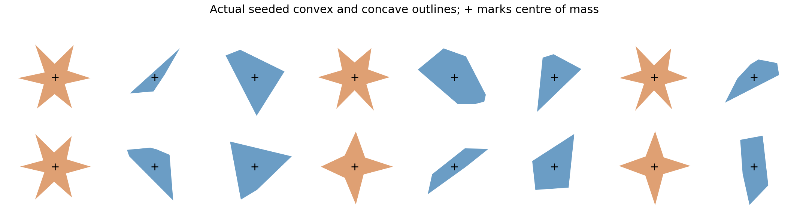

# Seeded random-shape verification

Executed 5 October 2026. Synthetic SI geometry and coefficients; numerical verification does not authenticate a physical material.

Two seeds generate eight native scenes: irregular convex drops, concave drops, off-centre pair collisions and shaking containers with 36 mixed bodies (12 concave). **4/8 references qualify** on all four predeclared refinement edges; **12/40 candidate settings pass against a qualified reference**. **2 native attempts are rejected**.

The independent sparse kernel accepts **24/24 solves** on twelve real support-contact chains of 8, 32 and 128 polygon bodies. All accepted states satisfy independently checked normal complementarity, impulse application and energy minus prescribed-wall work; friction additionally satisfies capacity and opposition to final slip. These snapshots have nonzero normal/tangent coupling. They are constructed from actual polygon vertices, rather than arbitrary contact matrices.

## Geometry and physical scope

Convex outlines are hulls of seeded random points. Concave star outlines use a fan of triangles with disjoint interiors and shared edges, joined as one rigid body. Areal density sets each dynamic body to 1 kg. Exact polygon integrals locate its COM and moment of inertia. Bodies are centred on their COM and bounded by a declared radius; every initial mixed-box cell is clear of other bodies and walls including the 0.01 m fixture skin. Fixture skins may overlap at concave decomposition seams, and internal fixture features are not suppressed. This is a known limitation of this representation. No deformable rods or FEM continuum is simulated.

Native runs use pinned Box2D 2.4.1 and 3.1.1 adapters. The collision skin is fixed across fidelity settings, friction is 0.4, restitution zero, rolling zero, and gravity 9.81 m/s² except in the isolated pair. No material coefficient is tuned to make a fast run match. The frozen kernel uses zero-skin exact core support contacts, friction 0.2 and zero restitution. It does not integrate these trajectories or perform native collision discovery.

## Reference qualification and candidate accuracy

Primary collision updates refine 4 → 8 → 16 at 64 velocity iterations; velocity iterations refine 16 → 32 → 64 at 16 primary updates. All four adjacent edges must have RMS position ≤0.005 m, velocity ≤0.0125 m/s and spin ≤0.0125 rad/s. Candidates use budgets four times larger. A failed reference prevents an accuracy claim even when a candidate is close to it. This is a bounded trajectory study, not a proof for all shapes or long time horizons.

| Scene | Reference qualified | Worst normalized refinement error | Passing candidate settings |
|---|---|---:|---|
| random_42_convex_drop | True | 0.541 | block_p1_s8, block_p4_s16, block_p8_s32 |
| random_42_concave_drop | False | 11.1 | none |
| random_42_oblique_pair | True | 0.0078 | block_p1_s8, block_p4_s16, block_p8_s32 |
| random_42_mixed36_shake | False | 233 | none |
| random_7301_convex_drop | True | 0.358 | block_p4_s16, block_p8_s32, temporal_p4_s16 |
| random_7301_concave_drop | False | 23.2 | none |
| random_7301_oblique_pair | True | 0.741 | block_p4_s16, block_p8_s32, temporal_p4_s16 |
| random_7301_mixed36_shake | False | 231 | none |

For the four qualified scenes, the cheapest passing candidate can be selected retrospectively from the declared settings. This is scene-specific selection after verification, not an online controller or a held-out prediction of the cheapest setting.

| Qualified scene | Cheapest passing setting | Median native time (ms) | Reference time (ms) | Reference/candidate ratio |
|---|---|---:|---:|---:|
| random_42_convex_drop | block_p1_s8 | 0.313 | 15.038 | 48.08 |
| random_42_oblique_pair | block_p1_s8 | 0.205 | 2.999 | 14.65 |
| random_7301_convex_drop | block_p4_s16 | 1.477 | 12.401 | 8.40 |
| random_7301_oblique_pair | block_p4_s16 | 0.631 | 3.093 | 4.90 |

Timing: one warm-up plus three repetitions, single-thread BLAS/OMP. Native medians measure compiled engine and controller time, excluding Python/process/serialization. Frozen kernel medians include inverse-mass/contact-map assembly and solving, excluding geometry generation, startup and archive writing. These are different scopes and cannot be divided to claim a full-engine speedup. No random-shape dense control is measured here.

## Frozen physical contacts

Adjacent bodies occupy disjoint x intervals and touch at their extreme vertices, with horizontal normals in both support cones. Outer contacts lie on prescribed moving wall planes. Contact points and lever arms are measured from the actual COM. A random initial translation and spin makes the solves nontrivial. Each accepted output is archived; failures retain their inputs and explicit reason. This deliberately tests a chain topology, not every possible packed polygon contact graph.

| Bodies | Seed | Shape | Law | Accepted | Assembly + solve median (ms) |
|---:|---:|---|---|---|---:|
| 8 | 42 | convex | normal | True | 2.018 |
| 8 | 42 | convex | friction | True | 3.326 |
| 32 | 42 | convex | normal | True | 1.768 |
| 32 | 42 | convex | friction | True | 4.532 |
| 128 | 42 | convex | normal | True | 3.088 |
| 128 | 42 | convex | friction | True | 6.821 |
| 8 | 42 | concave | normal | True | 1.359 |
| 8 | 42 | concave | friction | True | 2.867 |
| 32 | 42 | concave | normal | True | 6.392 |
| 32 | 42 | concave | friction | True | 6.052 |
| 128 | 42 | concave | normal | True | 3.211 |
| 128 | 42 | concave | friction | True | 9.463 |
| 8 | 7301 | convex | normal | True | 2.073 |
| 8 | 7301 | convex | friction | True | 3.252 |
| 32 | 7301 | convex | normal | True | 2.453 |
| 32 | 7301 | convex | friction | True | 3.429 |
| 128 | 7301 | convex | normal | True | 2.641 |
| 128 | 7301 | convex | friction | True | 5.995 |
| 8 | 7301 | concave | normal | True | 1.741 |
| 8 | 7301 | concave | friction | True | 3.788 |
| 32 | 7301 | concave | normal | True | 2.116 |
| 32 | 7301 | concave | friction | True | 5.428 |
| 128 | 7301 | concave | normal | True | 3.526 |
| 128 | 7301 | concave | friction | True | 10.446 |

## Native rejections

- `random_42_mixed36_shake__temporal_p4_s16`: Rigid backend failed: Convex ordered polygon required
- `random_7301_mixed36_shake__temporal_p4_s16`: Rigid backend failed: Convex ordered polygon required

Strict mathematical convexity and the adapter’s edge-length check do not guarantee acceptance by native hull welding/validation tolerances. A production geometry pipeline needs an explicit admissibility check and a disclosed repair policy. These rejections remain failures; their geometry was not regenerated to remove them.

## Reproduction and next step

Plan/generator initial commit: `dd0f2e8f5f06360494ab11d2e2d7a3864087b79f`. Execution source: `e4c1b41e9a2ead4cfc7e96d3be0303c333e2207a`. The runner was changed to preserve native rejections after the first incomplete pass; geometry, seeds and accuracy gates were unchanged. The source archive records the execution bytes. `scenes.json`, `traces.zip` and `summary.json` retain geometry, full trajectories, failed inputs, timings and hashes.

Run `OPENBLAS_NUM_THREADS=1 OMP_NUM_THREADS=1 python -m research.run_random_shape_study`, then `python -m research.audit_random_shape_study` and `python -m research.make_random_shape_report`. Both native backends must be built first.

The next integration step is a geometry pipeline that exports actual evolving manifolds into the sparse solver, with admissibility and decomposition-seam checks. Random-shape kernel acceptance does not establish native trajectory accuracy or preserve the prior disk-row speedup on arbitrary dense contact graphs. Failed reference scenes need further refinement or appropriately declared ensemble/observable metrics before selecting a fast setting.
