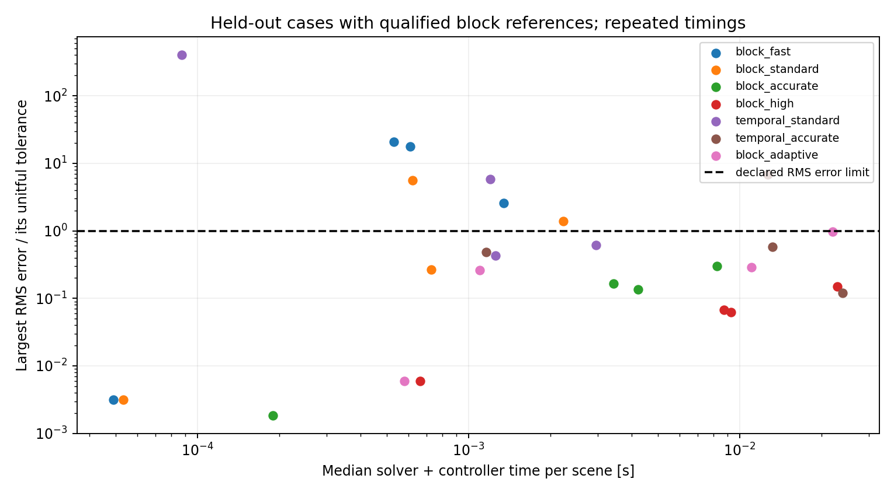

# Executed planar rigid collision study

The defensible present recommendation for this repository is **coupled two-point
normal contacts, warm-started global sequential impulse iteration, continuous
collision detection, and adjustable collision-update time**. For the tested
meter-scale polygon regime, the measured conservative setting is Box2D 2.4.1's
block solver with **four primary steps and sixteen velocity iterations** per
1/120 s output frame. This is a tested baseline, not a claim that an older release
is the world's best engine. Numerical adaptation is implemented, but the first
controller does not earn a performance recommendation.

## Scope and evidence

The [method selection](rigid_method_selection.md) links the checked author
documentation, explains why temporal/soft and block contacts differ, and records
an independent restitution counterexample. The [source lock](rigid-benchmarks/source-lock.json)
pins both full source revisions and archive digests. Original sample sources,
licenses and the old block solver source are retained unchanged.

The executable [runner](../rigid_backend/README.md) supports rotating convex
polygons and compounds of convex polygons, persistent multipoint contacts,
frictional stacks, many-body contact chains and CCD. A body's fixtures stay
attached rigidly; no elastic material deformation is being simulated. It does
not solve a whole contact island's complementarity equations exactly: two normal
points in each manifold are solved together, then contacts are iterated globally.

The study ran 17 predeclared verification, training, test and stress scenes:
hexagons, triangles, a concave L, spinning thin bars, thin-wall high-speed impact,
stacks, 30:1 and 100:1 mass contrasts, a 12-body impact chain, a public friction
sample adaptation and a 20-second tilted stack. The latter two are adaptations
of published numerical samples, not reproductions of physical experiments.
Every input is in [scenes.json](rigid-benchmarks/results/scenes.json).

Mass, COM, inertia, fixture friction/restitution, initial conditions, gravity,
duration and a common 0.01 m collision skin are preserved across comparisons.
Mass properties use unrounded polygon cores. The collision skin is therefore a
contact geometry tolerance; it contributes no extra mass. Density is areal
kg/m², not a silently assumed 3D material density.

## Acceptance rules

The declared full-history RMS tolerances are 0.02 m position, 0.05 m/s linear
velocity and 0.05 rad/s spin. The normalized score is the largest ratio of a
quantity's error to its own tolerance; it must be at most one. Position and
velocity use the Euclidean vector error before RMS averaging over time and
bodies. Units are never mixed into an unscaled sum. Angle itself and worst-case
per-body errors are not acceptance criteria in this first study.

For each backend and scene, primary steps are refined 4 → 8 → 16 at 32 solver
steps, and solver steps 8 → 16 → 32 at 16 primary steps. The last two changes in
both axes must each satisfy one quarter of the candidate error budget. The
block backend's solver steps are velocity iterations, with three position
iterations fixed; temporal steps are actual substeps. Equal work counts across
backends are not equal algorithms or costs. Spatial fixture discretization,
collision skin and position iterations are not independently refined here.

Ten of seventeen block references pass these numerical consistency checks.
Passing is not a convergence proof, and a converged solver can implement a
physically unsuitable contact law. **The temporal reference passes its refinement
check for symmetric rebound while failing the independent analytic result.**
This is why fine simulation alone is insufficient evidence of authenticity.

Timing includes native integration and the actual controller's feature/decision
work. Shared state extraction, diagnostic extraction and JSON output are
excluded; the adapter separately exposes subprocess end-to-end wall time.
Each evaluated mode has an excluded warmup and five repetitions. Timings were
grouped rather than randomized/interleaved and were collected on one shared
Xeon Platinum 8573C Linux environment. They support a local engineering decision,
not a portable throughput ranking or statistical confidence bound. First-study
CSV preserves median/min/max; future runs additionally preserve every sample.

## Results

[Raw comparisons](rigid-benchmarks/results/comparisons.csv),
[reference checks](rigid-benchmarks/results/reference-checks.json) and
[complete checksum-verified traces](rigid-benchmarks/results/README.md) accompany
this report. Counts below refer only to the ten qualified block references.
Cross-backend agreement includes differences in stabilization and contact
formulation; its reference favors a particular hard-contact approximation and
must not be mistaken for experimentally established truth.

| Mode | Collision updates / velocity iterations or temporal substeps | Cases within all RMS budgets |
|---|---:|---:|
| Block fast | 1 / 1 | 4 / 10 |
| Block standard | 1 / 8 | 7 / 10 |
| Block accurate | 4 / 16 | 10 / 10 |
| Block high | 8 / 32 | 10 / 10 |
| Block adaptive, frozen | variable | 9 / 10 |
| Temporal standard | 1 / 4 | 6 / 10 |
| Temporal accurate | 4 / 16 | 7 / 10 |

The independent central rebound test uses equal unit-mass square bodies,
velocities ±2 m/s, restitution 0.6 and zero friction. Classical symmetry and the
isolated restitution law give outgoing velocities ∓1.2 m/s and zero spin. The
block accurate setting reproduces these within floating-point error. The
measured temporal setting gives ∓1.056 m/s and opposite spins of 0.288 rad/s:
12% too little rebound speed and unwanted rotation. Linear momentum conservation
alone would not detect this failure. The [sweep](rigid-benchmarks/rebound-counterexample.json)
records adverse as well as favorable solver refinements.

The adaptive block policy also gets those final rebound velocities and zero
spin correct. Its one-update approach reaches the impact at a different output
sample, however, yielding a normalized full-history error of 5.315. A correct
impulse is not sufficient for accurate collision timing. In a discontinuous
rigid impact, sampled velocity error is particularly sensitive to event timing;
future evaluations should report impact-time error and post-impact observables
separately alongside, rather than replacing, the declared trajectory score.

## What adaptation actually achieved

The controller promotes fidelity from motion/size ratio, reported penetration,
dynamic contact-island size and mass ratio; it demotes after a dwell period.
It retains one native world and warm contact caches. All bodies share a chosen
level, so isolated easy bodies can be refined unnecessarily. Known-contact
features cannot certify safety before an unseen contact is detected.

Eight threshold/work candidates were calibrated before held-out evaluation.
Only two training references qualified (flat slider and six-body stack). The
triangle and 30:1 stack were excluded rather than silently used as truth.
Several candidates had identical training errors and unexercised high-work
branches. Runtime noise could decide between them; those training data do not
identify a generally optimal controller.

All four held-out scenes with qualified references meet the frozen adaptive
budget. **None is faster than the cheapest tested fixed block setting that
meets that same budget.** These are measured per-scene median times, in ms:

| Held-out qualified scene | Cheapest passing fixed setting | Fixed | Adaptive | Adaptive/fixed time |
|---|---|---:|---:|---:|
| Concave L drop | Standard | 0.727 | 1.101 | 1.51 |
| Spinning thin bar | Accurate | 3.433 | 11.072 | 3.23 |
| Thin-wall CCD | Fast | 0.049 | 0.578 | 11.80 |
| 12-body impact chain | Accurate | 8.242 | 22.066 | 2.68 |



Adaptive code working is different from adaptive code being beneficial. Neither
cheap tuning nor more work guarantees improvement. Keep fixed accurate as the
current conservative choice, and expose cheap fixed settings explicitly for
regimes whose outputs have been checked. The prototype is available for further
research and should not be enabled as an automatic accuracy guarantee.

## Hard cases and honest limits

Triangle/oblique drops, the twelve-body stack, both mass contrasts, friction
slopes and the long tilted stack fail the initial block reference qualification.
Their curves and timings remain in the data, but they cannot support favorable
matched-error claims. Pointwise late trajectories of unstable stacks can diverge
while aggregate quantities remain close; both must be reported explicitly.
A higher-resolution follow-up is being stored separately, without retuning the
policy or revising the first held-out score.

The benchmark does not include joints, 3D contact cones, materials with true
elastic contact history, separate static/dynamic coefficients, rolling in the
block backend, deformable FEM, GPU workloads or thousands of bodies. It cannot
establish superiority over MuJoCo, Drake, Chrono, other rigid solvers or IPC/FEM.
Our custom compliant local model is useful for contact-history research but is
not an independent moving-polygon reference for these scenes.

## Physical authenticity and the next admissible improvement

Current friction and restitution values are declared numerical inputs. Public
source provenance authenticates where a value came from; it does not authenticate
how a real surface behaves. To claim physical accuracy, obtain measurements with
uncertainty for several impact speeds, angles and locations, including tangential
rebound/spin and frictional stopping. Fit one transferable material-pair model on
training observations and validate unseen conditions. Do not fit restitution or
damping to compensate for a poorly resolved solver.

Keep the contact law fixed while adapting numerical work first. A next controller
should predict approaching contacts, budget collision-time error, use measured
solver residuals or cheap/high local comparisons, and allocate effort per
independent contact island. Its overhead and missed promotions must be measured.
Use the current held-out scenes as development evidence now; a revised controller
needs new untouched test scenes before making a new generalization claim.

A later rigid/compliant/deformable switch must additionally preserve momentum,
angular momentum, recoverable contact/material energy and internal history.
Partitioning a body into spring-connected rigid cells adds material parameters
and dispersion/objectivity concerns. The earlier rod experiment does not yet
justify replacing continuum dynamics for arbitrary impact. No new friction law
or publication-worthy adaptive superiority has been established by this study.

## Reproduction

Build both pinned backends following [the backend guide](../rigid_backend/README.md),
then run:

```sh
python -m research.run_rigid_study --repeats 5 --output /tmp/new-rigid-study
python -m research.audit_rigid_study --pack --directory /tmp/new-rigid-study
python -m research.audit_rigid_study
python -m research.refine_rigid_references
```

The original frozen policy and histories stay in the repository. Repetition
changes runtime samples and may change calibration ties; numerical results are
compared with tolerances, not an unsupported bitwise determinism promise.
