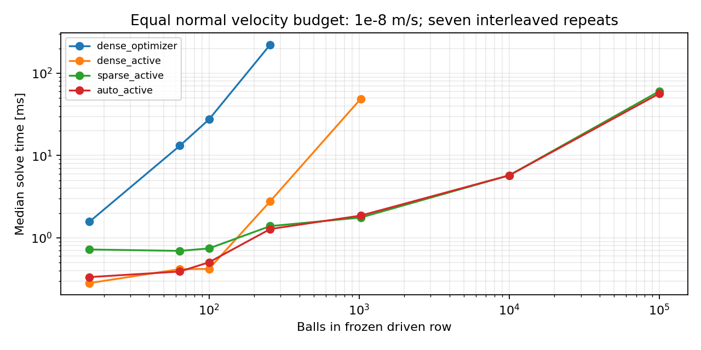

# Sparse coupled-contact performance

Executed 4 October 2026. This is a measured improvement to a frozen-contact kernel. It does not establish full-engine speed, collision-discovery performance, physical material accuracy, Vektor compiler execution, WASM or GPU performance.

At 256 balls the new sparse pipeline is **81.4 times faster** than the existing dense verification optimizer: 278.5 ms versus 3.42 ms for contact construction, matrix preparation and solve. At 1,024 balls, sparse solving is **27.6 times faster** than the dense version of the same active-set algorithm; the cold pipeline gain is 8.4 times. This separates a better algorithm from sparse-factorization gains.

All normal cases meet a maximum individual velocity error of 1e-8 m/s and the declared reaction impulse tolerance. The packed rigid row must propagate box velocity to every ball. Actuator work and kinetic/dissipated energy are independently audited. The sparse implementation reaches 100,000 balls; the dense controls are only executed within their declared size limits. No extrapolated dense runtime is presented.

## Protocol and numerical model

The plan was pushed before execution. Seven interleaved repeats follow one warm-up per setting. BLAS/OMP threads are one. Each solve performs a fresh factorization; there is no reuse of the answer. Cold totals include Python contact construction, mass/contact-map assembly and mobility preparation. Process/library startup, archive writing and audit are excluded. Timings are one-machine evidence, not a general hardware guarantee.

The old baseline is the existing dense L-BFGS-B normal optimizer with stationarity correction. The same-algorithm dense control uses the new active set with dense factorization. The sparse version stores inverse mass as a vector, the contact Jacobian as CSR and factors only the free contact block. Bound steps preserve feasibility. Singular free blocks use least squares without adding contact softness. Failed KKT/velocity checks reject the result. Block active sets can still fail on some graphs; no universal convergence claim.

Automatic normal dispatch uses dense factorization for at most 128 contacts and sparse otherwise, with the same physical law and tolerances. Friction dispatch uses the smaller bounded tangential solve only if the normal/tangent cross-block is exactly zero. Other contacts use a sparse semismooth solve with merit line search and an explicitly reported least-squares fallback. Small nonzero coupling is never discarded.

## Normal results

| Balls | Method | Cold median (ms) | Solve median (ms) | Operator arrays (KiB) |
|---:|---|---:|---:|---:|
| 16 | dense_optimizer | 2.102 | 1.569 | 42.9 |
| 16 | dense_active | 0.8828 | 0.2819 | 5.566 |
| 16 | sparse_active | 1.358 | 0.7214 | 3.309 |
| 16 | auto_active | 1.155 | 0.3331 | 5.566 |
| 64 | dense_optimizer | 15.86 | 13.15 | 627.1 |
| 64 | dense_active | 1.212 | 0.416 | 45.69 |
| 64 | sparse_active | 1.491 | 0.6937 | 12.68 |
| 64 | auto_active | 1.268 | 0.3893 | 45.69 |
| 100 | dense_optimizer | 33.45 | 27.4 | 1514 |
| 100 | dense_active | 1.331 | 0.4189 | 99.41 |
| 100 | sparse_active | 1.766 | 0.7432 | 19.71 |
| 100 | auto_active | 1.282 | 0.5041 | 99.41 |
| 256 | dense_optimizer | 278.5 | 222.8 | 9804 |
| 256 | dense_active | 4.714 | 2.785 | 566.2 |
| 256 | sparse_active | 3.423 | 1.387 | 50.18 |
| 256 | auto_active | 3.819 | 1.278 | 50.18 |
| 1,024 | dense_active | 53.53 | 48.7 | 8408 |
| 1,024 | sparse_active | 6.343 | 1.762 | 200.2 |
| 1,024 | auto_active | 6.681 | 1.862 | 200.2 |
| 10,000 | sparse_active | 36.81 | 5.744 | 1953 |
| 10,000 | auto_active | 37.69 | 5.74 | 1953 |
| 100,000 | sparse_active | 417 | 60.53 | 1.953e+04 |
| 100,000 | auto_active | 412.6 | 56.69 | 1.953e+04 |

Operator arrays count explicit inverse-mass, contact-map and mobility storage. They exclude input objects, preparation scratch, LU factors, Python/library memory and process overhead; this is not a peak-RAM measurement. Sparse factor fill can be large on more connected graphs. Linear storage/work trends shown here belong to the row topology.

## Coulomb friction results

Rows start with lateral velocity 2 sin(0.37 times body index), wall velocity (1,0.2) m/s and synthetic friction 0.02 or 0.4. The first includes sliding contacts, the second sticks in these snapshots. The implicit inelastic law enforces normal complementarity, static capacity and saturated friction opposing final slip. It has one friction coefficient, zero restitution, no stored tangential elasticity and no rolling couple. It is not the separate elastic static/dynamic/history material model.

| Balls | Friction | Strategy | Cold median (ms) | Solve median (ms) | Sliding contacts |
|---:|---:|---|---:|---:|---:|
| 16 | 0.02 | auto | 1.826 | 0.9589 | 1 |
| 16 | 0.02 | general | 2.51 | 1.587 | 1 |
| 16 | 0.4 | auto | 1.568 | 0.7728 | 0 |
| 16 | 0.4 | general | 2.168 | 1.433 | 0 |
| 100 | 0.02 | auto | 2.945 | 1.678 | 1 |
| 100 | 0.02 | general | 3.846 | 2.845 | 1 |
| 100 | 0.4 | auto | 2.237 | 1.154 | 0 |
| 100 | 0.4 | general | 2.954 | 1.985 | 0 |
| 1,024 | 0.02 | auto | 8.552 | 5.528 | 4 |
| 1,024 | 0.02 | general | 8.222 | 5.091 | 4 |
| 1,024 | 0.4 | auto | 6.401 | 2.675 | 0 |
| 1,024 | 0.4 | general | 6.845 | 3.688 | 0 |
| 10,000 | 0.02 | auto | 41.96 | 15.92 | 1 |
| 10,000 | 0.02 | general | 71.25 | 34.36 | 1 |
| 10,000 | 0.4 | auto | 51.59 | 13.15 | 0 |
| 10,000 | 0.4 | general | 49.76 | 23.18 | 0 |

The fast path is not uniformly faster. At 1,024 balls with friction 0.02 it is slower than the general solve; at 10,000 balls with friction 0.4 it reduces solve time but the measured cold pipeline is slightly slower. Contact construction dominates some large cases. All sixteen outputs pass normal/cone/slip/energy gates and match their counterpart strategy within 1e-8. No physical parameter is changed to obtain the speed gain.

Rigid redundant pressure impulses can be nonunique. The normal active-set initialization chooses a pressure distribution; friction can depend on that choice. Verified residuals do not prove a unique or experimentally authenticated force history. Finite compliance or another declared pressure-selection policy is needed where that distinction matters.

## Irregular held-out stress set

**96/100 accepted; four rejected.** The seed 20261005 set was declared before the run and differs from the exploratory development seed 81. It contains random off-centre algebraic contact graphs, not measured or guaranteed valid shape geometries. All accepted outputs pass an independent dense point-map audit of normal complementarity, friction and body-energy change. One accepted case uses the disclosed fallback. Failed input snapshots are retained with the numerical errors.

Rejected case IDs: 17, 19, 57, 88. These failures establish an implementation/model limitation. The experiment does not prove whether each case has no Coulomb solution. Do not deploy this prototype as the sole general collision solver or silently count fallback/rejection as success.

## What this changes

The many-body normal correctness oracle no longer needs dense all-body/contact matrices or the iterative optimizer used by the earlier reference for the tested rows. A frozen island can select a faster algebraic solver without changing friction or restitution. The gain is an implementation result using established mechanics and numerical methods, not new collision theory. The earlier dense moving-container trajectories remain unqualified; this kernel benchmark does not repair or replace that evidence.

Next: port sparse assembly and factorization into the actual engine, profile contact discovery/input preparation, preserve contact/history state, and test complete moving containers against independently qualified observables. General rejected cases need a robust recovery policy with the same mechanical contract. Automatic numerical placement and native/WASM/GPU acceptance in Vektor remain separate compiler work.

## Reproduction and prior art

Run the commands in README.md. The independent audit checks 139 snapshots: 23 normal outputs, 16 friction outputs and 100 stress inputs/outcomes.69 local tests pass. The versioned source archive, state archive, all timing samples and hashes are retained.

Execution source: `6dd596654ccdc9d1e4967dcfc9c6b73bbd3f3e01`. State archive SHA-256: `332f3eecb8ae3f3cd71b2be22d5a2c9d07552f3828778063c2b9e2143a581f99`.

Relevant prior art: Alart and Curnier (1991), [A mixed formulation for frictional contact problems prone to Newton like solution methods](https://doi.org/10.1016/0045-7825(91)90022-x); Anitescu and Potra (1997), [Formulating Dynamic Multi-Rigid-Body Contact Problems with Friction as Solvable Linear Complementarity Problems](https://doi.org/10.1023/a:1008292328909). Titles, authors, years and DOIs were checked through Crossref metadata; that check is not a full-paper equation comparison. See also [SciPy sparse linear algebra](https://docs.scipy.org/doc/scipy/reference/sparse.linalg.html), [Catto, Solver2D](https://box2d.org/posts/2024/02/solver2d/) and the existing joint publication review.
