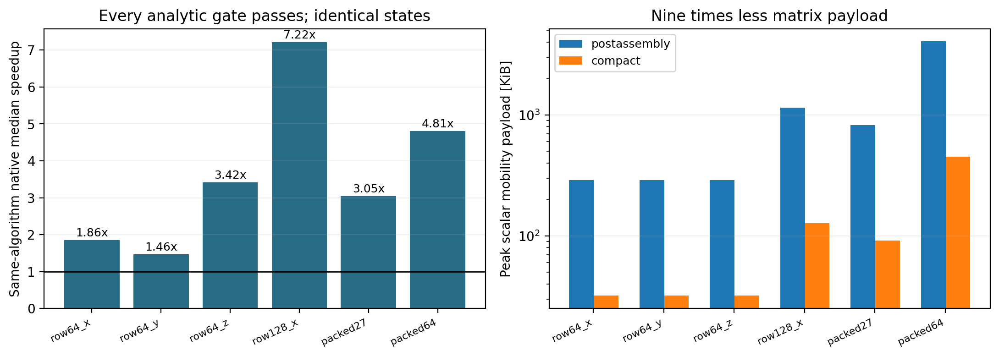

# Verified 3D simultaneous normal contacts and matrix assembly improvement

**6/6 analytic scenes pass. Measured native median gain: 1.46–7.22x, with bitwise-identical states and nine times less scalar mobility storage.**

The tested worlds contain native 3D collision discovery, full inertia, rotation and independently integrated bodies. A 100 m/s wall drives 64-body rows along x, y and z; a fourth row has 128 bodies; two full 3D containers contain 27 and 64 spheres. Every dynamic body reaches the analytic velocity after the first sampled impact frame, follows its analytic position, and passes penetration, spin, wall-work and energy gates. No solver rejection or upstream fallback occurs.

The optimized profile is **frictionless and inelastic**, with zero gravity and no position projection. It does not qualify the five failed frictional references in the [baseline study](../spatial-validation/report.md), change their budgets, or claim experimental material accuracy. Fifteen 3D regression tests also cover full-tensor off-center impulses, free spin, restitution, sliding friction, fast walls and rotating random hulls.



## Fair ablation

Both modes use the same mechanically gated normal quadratic program, timestep guard, start-of-update wall contact pose, velocity-only integration profile, geometry and mass/inertia. The postassembly mode constructs one normal and two tangent rows per contact and then removes tangent impulses fixed exactly to zero. The compact mode removes those fixed-zero variables before construction. It retains every coupling among the normal unknowns; a nonzero-friction scene is rejected rather than silently dropping tangent coupling.

The native normal QP uses Cholesky on positive definite active faces, a bound active set, and unilateral feasibility/complementarity checks. Redundant inactive normals can remain at zero impulse; pressure gauges need not be unique. Failed or singular active faces disclose upstream fallback, and the analytic protocol rejects any fallback. No compliance or diagonal regularization is added. The four direct QP regression cases cover inactive, redundant, coupled and separating normals.

| Scene | Bodies | Postassembly [s] | Compact [s] | Median gain | Matrix rows before/after |
|---|---:|---:|---:|---:|---:|
| row64_x | 64 | 0.13745 | 0.07400 | 1.86x | 192/64 |
| row64_y | 64 | 0.16538 | 0.11298 | 1.46x | 192/64 |
| row64_z | 64 | 0.24239 | 0.07093 | 3.42x | 192/64 |
| row128_x | 128 | 1.18656 | 0.16436 | 7.22x | 384/128 |
| packed27 | 27 | 1.01365 | 0.33239 | 3.05x | 324/108 |
| packed64 | 64 | 4.56796 | 0.95036 | 4.81x | 720/240 |

## Analytic and mechanical checks

Every retained repetition must satisfy all-body position and velocity errors <=1e-8 m and m/s; spin and closing contact speed <=1e-8 rad/s and m/s; contact penetration and container surface excess <=1e-8 m; wall-work and energy errors <=1e-5 J; and zero QP rejection/upstream fallback. Initial velocity is zero; the simultaneous inelastic result is v=U, spin zero and position x0+Ut. The expected wall work is N|U|² J for unit masses, and final kinetic energy is half that. Initial geometric overlap around 1e-10 m is disclosed to stabilize floating-point touching contact discovery. It remains bounded below the fixed 1e-8 m geometry gate.

Maximum observed errors over all 36 histories: position 3.64e-12 m; velocity 5.42e-11 m/s; spin 3.93e-12 rad/s; penetration 1.03e-10 m; surface excess 1e-10 m; wall-work error 4.69e-07 J. Every warmup and repetition has deterministic states, and before/after modes are bitwise identical.

## Scope and limitations

The measured speedup belongs to this native Float64 CPU implementation and these short, exactly solvable 0.04 s worlds, using one warmup and three retained repetitions. Timing includes contact discovery, control and diagnostics but excludes startup and JSON serialization. It is an implementation improvement over the same algorithm, not a universal solver ranking or evidence that frictional trajectories are accurate. Nine times less matrix payload does not mean nine times less process RSS; Bullet still owns manifolds, body data and other work buffers. Dense matrix assembly remains quadratic.

The start contact phase uses current wall pose and explicit prescribed velocity, then advances walls after dynamic integration. The legacy end phase advances walls before collision discovery and is preserved as the baseline study convention. Velocity-only disables split position projection and ERP; it cannot repair macroscopic initial overlap. A general solver still needs an appropriate geometric recovery/CCD policy. The relative-travel guard is not a universal exact swept-CCD proof.

Bullet baseline friction uses a two-direction pyramid with coefficient product mixing. Separate static/dynamic, elastic tangential, rolling and twisting resistance are not implemented in this adapter. The optimized normal profile explicitly rejects nonzero friction or restitution. These limits remain material for the intended frictional engine.

The mechanics and fixed-variable elimination are established methods. No new collision theory is claimed. The contribution here is a reproducible native 3D implementation, a clear failure boundary, independently verified analytic results, and a measured exact assembly reduction. The benchmark exercises full 3D contact graphs; the analytic packed case itself has zero spin. A separate native off-center compound-body test checks the optimized profile against full-tensor angular impulse mechanics.

## Reproduction

Execution source: `76e44754c09c36112e161441462ac5cd34687a49`. Full authored scenes, all 36 histories, warmup hashes, three timing samples, matrix sizes, fallbacks, analytic checks and execution sources are archived. Source hashes and plan are retained; an independent audit recomputes every analytic gate, all work/energy checks, identical-state comparisons and timing ratios.

```sh
cmake -S spatial_backend -B build/spatial -G Ninja -DCMAKE_BUILD_TYPE=Release
cmake --build build/spatial --target spatial_runner spatial_qp_checks -j 2
build/spatial/spatial_qp_checks
python -m unittest tests.test_spatial_engine -v
python -m research.audit_spatial_normal
python -m research.run_spatial_normal --directory /tmp/fresh-normal-study
python -m research.make_spatial_normal_report
```

The [typeset mechanics note](mechanics.pdf) derives the full 3D wedge, world inertia, global mobility, boundary work, normal complementarity and exact tangent-variable elimination. [Source](mechanics.tex) is reproducible with pdflatex.
