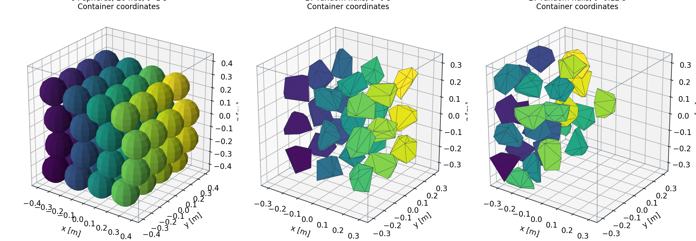
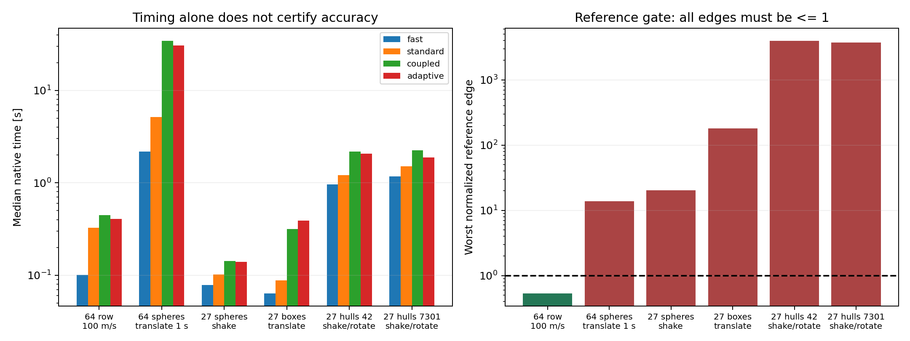

# Real 3D rigid collisions: fast moving walls and many bodies

Executed 2026-10-05. **1/6 references qualify** under the frozen protocol; all 102 retained histories are archived and independently audited.

The new engine is a genuine 3D, Float64 CPU implementation using unmodified pinned Bullet 3.25. It integrates arbitrary convex hulls, spheres, boxes and compounds with full inertia tensors and quaternion rotation. Twelve analytic and mechanics tests cover mass/inertia, off-center angular impulses, free spin, restitution, friction, 100 m/s walls driving 64 bodies, and 20 m/s containers with translation, shaking and rotation. This is public Python/C++ research; it is not a Vektor language port or compiler acceptance proof.



## Frozen protocol

The six scenes include a 64-body touching row at 100 m/s; a 64-sphere container translating 20 m/s for one second; 27-sphere shaking; 27-box translation; and random asymmetric convex 3D hulls at seeds 42 and 7301 in a container translating/reversing at 20 m/s and rotating/reversing at 10 rad/s. Other horizons are 0.04 s (row) and 0.12 s (containers). All contents are independently integrated; prescribed walls do not teleport them. Friction is synthetic pair coefficient 0.4, restitution zero, gravity 9.81 m/s² except the row. No material calibration or experimental authenticity is claimed.

Two adjacent travel refinements (fractions 0.06 -> 0.03 -> 0.015) and two adjacent velocity-iteration refinements (64 -> 128 -> 256) must all pass. References use the sequential solver consistently. Candidate RMS budgets are position 0.005 m, velocity 0.05 m/s, angular velocity 0.1 rad/s and quaternion geodesic orientation 0.01 rad; reference edges use one quarter of these values. Bodies and output times match exactly. Physical gates include actual surface containment within 0.002 m, quaternion norm error within 1e-12, nonpositive energy change after subtracting wall work (1 J tolerance), and row final velocity maximum error within 0.015 m/s. Native contact penetration and closing residuals are retained diagnostics; they were not silently added to or removed from the frozen qualification rules.

Wall motion is integrated in double precision and steps split exactly at velocity commands. The guard bounds relative translation and angular tip travel by a fraction of the smallest fixture half-width/radius, including gravity. It explicitly detects a fast wall crossing a stationary object; the unguarded one-step negative control tunnels. This is a conservative travel heuristic, not a general exact swept-CCD proof. Every internal update checks actual fixture support against every container plane. An independent offline audit reconstructs sampled supports, full kinetic plus gravitational energy, quaternions and every qualification decision.

## Results

| Scene | Worst reference edge / budget | Reference | Fastest verified candidate | Native median [s] |
|---|---:|---|---|---:|
| row64_100ms | 0.536 | pass | adaptive | 0.4063 |
| translate64_spheres | 13.8 | FAIL | none | -- |
| shake27_spheres | 20.2 | FAIL | none | -- |
| translate27_boxes | 180 | FAIL | none | -- |
| shake_rotate27_hulls42 | 3.96e+03 | FAIL | none | -- |
| shake_rotate27_hulls7301 | 3.75e+03 | FAIL | none | -- |



## Limits and interpretation

A failed reference produces no verified candidate and no accuracy-qualified speed claim. A passing gate certifies only these authored scenes, finite horizons, sample times and four RMS observables; it supplies no universal convergence order, experimental error bound or guarantee for every moving container. Containment and absence of tunneling are weaker claims than trajectory accuracy. The selected fastest mode is an offline decision from one warmup and three retained timing repetitions; adaptive selection remains an online heuristic. Timings include travel control, native mechanical diagnostics and solver choice, but exclude startup and JSON serialization.

Bullet friction has two independently limited tangent impulses, a pyramid approximation. Its tangent resultant can exceed an isotropic Coulomb circle by up to sqrt(2). Body coefficients multiply at a contact. Separate static/dynamic coefficients, elastic tangential history and rolling/twisting moments are absent from this adapter. Synthetic coefficients are not validated against real material experiments.

The coupled mode uses Dantzig MLCP with Bullet sequential fallback. The adapter raises the impulse sanity limit from 1000 to 1e30 N·s because high-speed rows can exceed 1000. Fallbacks are retained in every trajectory. Adaptive uses eight sequential iterations until 12 positive-impulse contacts or a closing residual above 0.01 m/s triggers the requested coupled iteration count, with 24-update dwell. It may inherit the coupled fallback and overhead, and is not assumed faster or more accurate.

| Scene | Fast/coupled/adaptive MLCP fallbacks | Standard max penetration [m] | Standard max surface excess [m] |
|---|---|---:|---:|
| row64_100ms | 0/1052/811 | 0.008215 | nan |
| translate64_spheres | 0/5370/4149 | 0.001601 | 7.129e-05 |
| shake27_spheres | 0/3/0 | 0.004988 | 0.001041 |
| translate27_boxes | 0/360/938 | 0.001394 | -0.001042 |
| shake_rotate27_hulls42 | 0/2453/2106 | 0.00117 | 0.0005289 |
| shake_rotate27_hulls7301 | 0/2295/2153 | 0.001107 | 0.0006159 |

## Reproduction and provenance

Execution source: `6576bc61852f677a06f6e85d34e6f5b649fb6499`. Bullet source: `2c204c49e56ed15ec5fcfa71d199ab6d6570b3f5`. Build pins include SHA-256 archives for Bullet and JSON. Full authored geometry, all states, update counts, wall work, fallbacks, timing and source snapshots are retained. The source/data/audit distinguish 3D results from earlier 2D studies.

```sh
cmake -S spatial_backend -B build/spatial -G Ninja -DCMAKE_BUILD_TYPE=Release
cmake --build build/spatial --target spatial_runner -j 2
python -m unittest tests.test_spatial_engine -v
python -m research.audit_spatial_study
python -m research.run_spatial_study --directory /tmp/fresh-3d-study
python -m research.make_spatial_report
```

Audit does not require a native build. A fresh execution requires a clean source checkout; new checkpoints reject a different source, binary or plan. Different compiler/platform timing is not assumed identical.

Sources: [Bullet 3.25 pinned implementation](https://github.com/bulletphysics/bullet3/tree/2c204c49e56ed15ec5fcfa71d199ab6d6570b3f5); [contact solver and friction implementation](https://github.com/bulletphysics/bullet3/blob/2c204c49e56ed15ec5fcfa71d199ab6d6570b3f5/src/BulletDynamics/ConstraintSolver/btSequentialImpulseConstraintSolver.cpp); [Dantzig MLCP and fallback](https://github.com/bulletphysics/bullet3/blob/2c204c49e56ed15ec5fcfa71d199ab6d6570b3f5/src/BulletDynamics/MLCPSolvers/btMLCPSolver.cpp). Existing mechanics and solver families are prior art; this verification is not a novelty claim.
